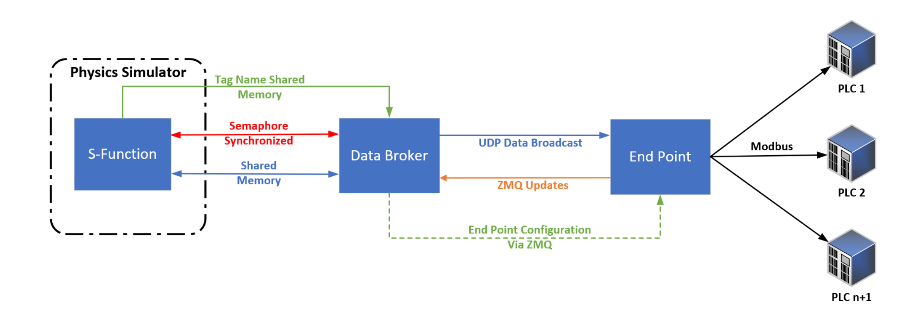
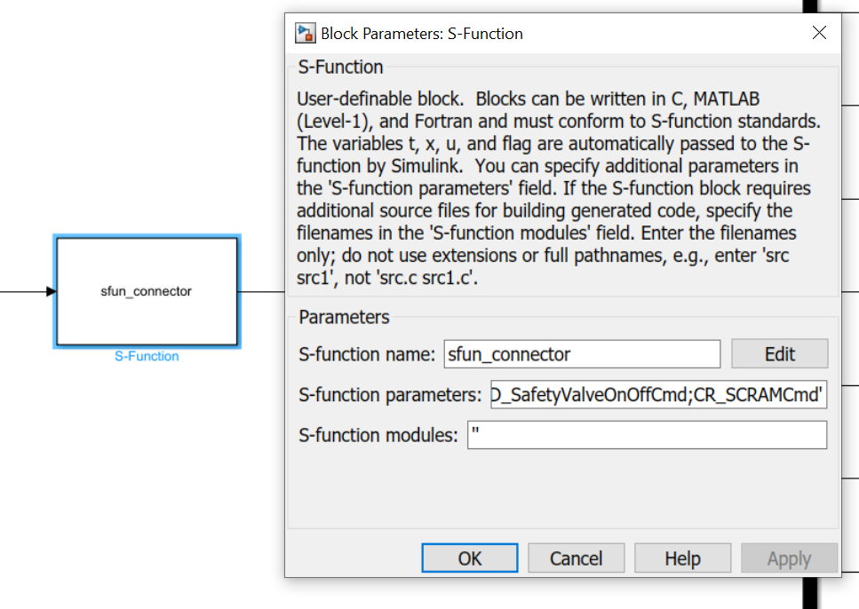
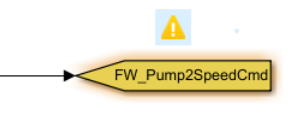
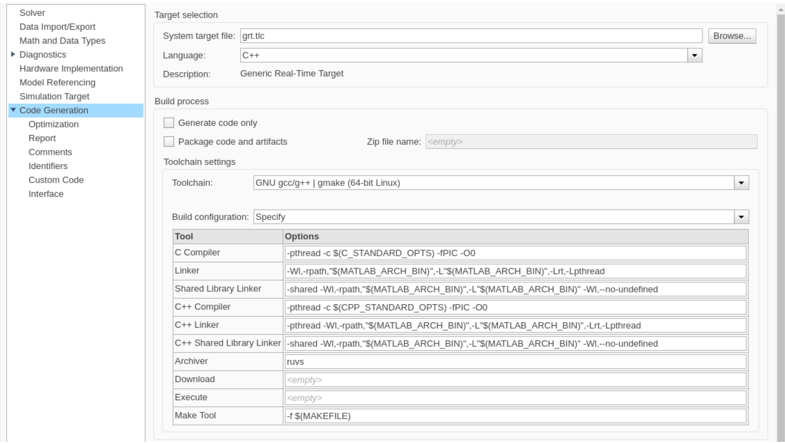
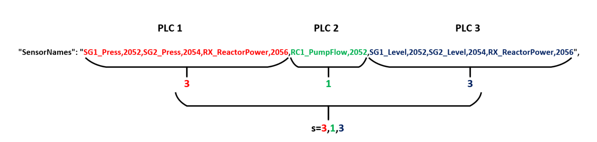
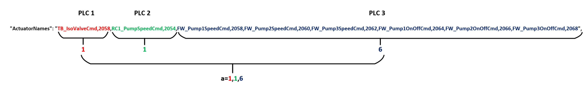

# Data Broker Setup Guide

The software package developed by Sandia National Laboratories is intended to allow the integration of Simulink models into emulations of control networks. To accomplish this, three programs are included:
- Simulink S-Function
- Data Broker
- End Point

## System Function Description
Initialization of the system runs through the following automatic procedures:
1. The Data Broker starts the compiled simulation
2. The S-Function communicates Tag names to the Data Broker
3. The Data Broker holds the simulation and begins End Point configuration
4. The Data Broker reads the JSON input file
5. The Data Broker establishes communication with each End Point and transfers its configuration.
6. The End Point reads configuration data and responds as ready to the Data Broker
7. The Data Broker confirms ready response from all End Points listed in JSON input file and begins real time synchronization of simulation.

The communication path functions as follows:
1. The simulation S-Function reports data values to the Data Broker via shared memory
2. The Data Broker broadcasts this new data via UDP to the End Points
3. End Points read the UDP broadcast and send the correct data to the PLC they are connected with.
4. The End Point monitors the PLC for an updated actuation value and retrieve the value when updated.
5. The End Point send the updated value to the Data Broker via ZMQ messaging.
6. The Data Broker reads this message and reports it to the S-Function on its next timestep
7. The S-Function reads in actuation values from the shared memory and exports these to the model.

## Requirements

The Data Broker and S-Function can only be used on Linux systems due to their reliance on the inter-process communications (IPC). The Data Broker and Simulink model must be co-located on the same virtual machine. The End Point is Python based and can be run on any operating system that can run Python. The Data Broker and each End Point must have clear TCP/IP and UDP lines of communication and be able to ping each other. The End Points will need 1 CPU core with 2 threads minimum, and approximately 200mb RAM. This requirement increases slightly as the number of PLC's the Endpoint is responsible for increases. The Data Broker and S-Function’s computational requirements will be dependent on the simulation they are attached to. Each program’s dependencies are listed below.

### Data Broker
- Linux OS (Ubuntu recommended)
- ZMQ C code library
### Simulink S-Function
- Linux OS (Ubuntu recommended)
- Matlab Simulink (for compilation)
### End Point
- Python 3.x
- ZMQ python library
- pymodbus library

## Configuration of S-Function

The Simulink S-Function is configured with the tags as an input parameter which can be set under the S-Function parameters. The tags are input following the convention:

    ‘Input_Tag_1;Input_Tag_2’,’Output_Tag_1;Output_Tag_2’

Input refers to data going into the S-Function to be distributed across the network, and Output refers to data retrieved from the network and reported out of the S-Function. The S-Function will use these tags to automatically configure the number of inputs and outputs, and it will report these to the Data Broker to configure the network communication handling. These tags will be used to call and report data from the End Point to the Data Broker.

The included Simulink model contains the S-Function connector and a switch system that allows automatic switching between internal simulation controllers and external ones connected to the Data Broker. This works by setting the initial values on the S-Function outputs to a presumed non-real value (-10e13). When this value is changed, the data stream switches from the internal controller to the external. This allows the full system to be connected to the S-Function and compiled once, but allows on the fly changing of which S-Function outputs are utilized.

The provided S-Function model allows drop in functionality with some simulations. The GoTo tags on the controllers must simply be changed to accomidate the rerouting of the signals through the S-Functions switch system. When dropped into the model, you will see the conflicting tags as shown above. Simply append the tag name with "_INT" to route the tag through the S-Function. Ex: "FW_Pump2SpeedCmd_INT"

## Compiling the Simulation

**Important Notes:**

- **The DataBroker program "DB" must be run prior to compiling the Simulink model.** It will fail to set up, but this initalizes the shared memory locations and semaphores. It can be stopped with Ctrl+c. Simulink Coder only has issues with shared memory and semaphores when compiling the simulation. 
- Run the included compile.sh in the DataBroker directory to compile the DB program.

The S-Function may be copied or drag and dropped into the model intended for use. The GOTO names must match the inputs and outputs desired. Included is a switch function on each output, this allows internal controllers to be used if external ones for that function are not connected. These are optional but can allow the user greater configurability without recompiling the simulation. If it is necessary to recompile the S-Function, Simulink mex should be used as “mex sfun_connector.c -lrt”. 

To compile the Simulink model with the S-Function included use the below settings for the Simulink Coder:

## DataBroker Configuration

The Data Broker reads an input .JSON file named “input.json” that must be co-located with the Data Broker. This must specify the IP of the machine each End Point is located on, the IP of the PLC the End Point will communicate with, the scan time of the PLC, the tag names of data reported (SensorNames) and retrieved (ActuatorNames) and their associated PLC memory register. This JSON file will be used by the Data Broker to configure the End Points on the network. Below is an example of the JSON:

    {
        "Simulator": [
            {
                "executableName": "ans_runtime_15mar21"
            }
        ],
        "Endpoints": [
            {
                "Node": "SG_P_Controller",
                "IP_Host": "192.168.1.4",
                "IP_PLC": "192.168.1.23",
                "SensorNames": "SG1_Press,2052,SG2_Press,2054,RX_ReactorPower,2056",
                "ActuatorNames": "TB_IsoValveCmd,2058",
                "ScanTime": "0.1",
                "TimeMem": "2048",
                "MemFormat": "32_float",
                "Endianess":"big,big",
                "Port":"502"
            }
        ]
    }

Let's break down what each of these configuration options is.

### Simulator 
 - **executableName**: the only option for Simulator, this allows you to specify what executable you want to have the DataBroker start and communicate with automatically. 
   - If you want to use this with an uncompiled Simulink model, or you want to control the physics program execution yourself, set this to "Simulink". Now the DB program will wait for you to start the program. (Note: Don't wait too long to start the program, as the Endpoints will timeout if they don't hear from the DB in 30 seconds)

### Endpoints
 - **Node**: This is the name of your Endpoint, its just for your sake to keep track of who is who.
 - **IP_Host**: The IP address of where your Endpoint lives. 
   - This could be 127.0.0.1 if you are running the Endpoint on the same machine as your DB.
 - **IP_PLC**: The IP(s) of the PLC(s) the Endpoint is talking to. 
   - Again this could be 127.0.0.1 if the Endpoint and PLC are on the same machine. 
   - You can have your DB, Endpoint, and PLC all on the same machine. In that case it is good practice to set the IP of the Host as the IP of the machine, and IP of the PLC as 127.0.0.1
   - You can enter multiple IPs for multiple PLCs here seperated by comma's (,). See MultiPLC section for more.
 - **SensorNames**: The names of the value key tags followed by the PLC memory address physics values from the simulator will be written. "Input_Tag,PLC_Memory_Location"
   - The names of the key tags corrospond to the Input_Tags you have writen in the S-Function configuration.
 - **ActuatorNames**: The names of the value key tags followed by the PLC memory address for actuation values from the PLC to be read and reported to the simulator. "Output_Tag,PLC_Memory_Location"
   - The names of the key tags corrospond to the Output_Tags you have writen in the S-Function configuration.
 - **ScanTime**: The time frequency that the Endpoint will write and read from the PLC. Units in seconds.
   - Setting this to "0" the Endpoint will read and write to the PLC as fast as it can.
 - **TimeMem**: This is the memory address for the Endpoint to report simulation time to the PLC. 
   - This is an optional feature and can be disabled by setting to "-1"
 - **MemFormat**: This defines the format the Endpoint will write and read to the PLC.
   - Available formats:  16_float, 32_float, 64_float, 16_int, 32_int, 64_int, 16_uint, 32_uint, 64_uint
 - **Endianess**: This defines the word and byte order for the PLC memory format ("byte_order,word_order"). This is a pair combination of "big" and "litle". ("big,big","litle,big")
 - **Port**: The port that the PLC is communicating on. Modbus default is 502.

### MultiPLC

Each endpoint can be setup to communicate with multiple PLC. This requires the use of the MultiPLC option in the input JSON. Below is an example of the input JSON with an endpoint connecting to 3 PLCs.

    {
        "Simulator": [
            {
                "executableName": "ans_runtime_15mar21"
            }
        ],
        "Endpoints": [
            {
                "Node": "SGP_RCP_SGL_Controllers",
                "IP_Host": "192.168.1.4",
                "IP_PLC": "127.0.0.1,192.168.1.22,192.168.1.23",
                "SensorNames": "SG1_Press,2052,SG2_Press,2054,RX_ReactorPower,2056,RC1_PumpFlow,2052,SG1_Level,2052,SG2_Level,2054,RX_ReactorPower,2056",
                "ActuatorNames": "TB_IsoValveCmd,2058,RC1_PumpSpeedCmd,2054,FW_Pump1SpeedCmd,2058,FW_Pump2SpeedCmd,2060,FW_Pump3SpeedCmd,2062,FW_Pump1OnOffCmd,2064,FW_Pump2OnOffCmd,2066,FW_Pump3OnOffCmd,2068",
                "ScanTime": "0.1,0.1,0.1",
                "TimeMem": "2048,2048,2048",
                "MemFormat": "32_float,32_float,32_float",
                "Endianess":"big,big,big,big,big,big",
                "Port":"502,502,502",
                "MultiPLC": "s=3,1,3;a=1,1,6"
            }
        ]
    }

The MultiPLC option informs the Endpoint on how to divide the sensor and actuator tags and memory addresses. The input format for MultiPLC is s=sensors;a=actuators, this is broken down in the graphic below.

In the order of the IP's for the multiple PLC's connected to the endpoint, list out the sensor tags and memory addresses for each. The number of tags for each is then recorded in the "s" of the MultiPLC setting. In this example we have 3 sensor tags to report to the 1st PLC, so the first number in the "s" is "3". The 2nd PLC has one sensor tag, so the second number in the "s" setting is "1", and so on for all the PLC's.

Actuators follow the same scheme as the sensors, but are recorded in the "a" setting. An important note is that actuator tags cannot be repeated, 2 PLC's cannot both be reporting actuation values to the same tag. The system will allow it, but there will then be a race condition between the two.

Now we can combine the sensor "s" and the actuator "a", seperated by a semicolon ";". This becomes our "MultiPLC" option. Now the Endpoint can figure out how to communicate to multiple PLCs!

## Starting the simulation

After we have the system compiled, the JSON setup, and the PLC's started and ready to recieve TCP communications, we can start the Data Broker System!

The way we start the system depends on the conditions we have configured. We will cover 3 ways to start the system depending on configuration.

1. The DataBroker will start the compiled executable and have one Endpoint co-located with the DataBroker.
   * Included with the code is a bash script that can start the entire system in this configuration.
   * Run as sudo ./single_node.sh
   * This will start both the DB and Endpoint
2. The DataBroker will start the compiled executable and Endpoint(s) distributed on the network.
   * The Endpoint should be started first.
     * *$ python3 EndPoint.py*
   * Now the compiled DataBroker should be started after all the Endpoints are started.
     * *$ ./DB*
3. The DataBroker is connected to an uncompiled Simulink program *OR* some other program you are manually controlling.
   * Start the DataBroker first. It will print a message when it is ready for you to start the Simulink program.
     * *$ ./DB*
   * Start the manually controlled program when the DB promts you.
   * Now start your Endpoints.

This discribes the recomended way to start the system, but techncially it doesn't matter the order in which you start the programs. They have a very high likelihood of starting sucessfully in any order ~%95. The orders described though have a near %100 sucess rate if the system is configured correctly. That said, lets talk about troubleshooting.

### Stoping the DataBroker

Press x and enter on the terminal the DB is running in. This will safely stop the DataBroker, Simulation, and all the Endpoints.

## Troubleshooting

This is documenting some hints for if you have issues with the system.

### Simulink wont compile!

 - Ensure that the code compilation settings are correct.
 - Run the DB program for 10 seconds and kill it
 - Check the S-Function *sfun_connector.c* and *sfun_connector.mexa64* are in the active directory for Matlab, and correctly located.
 - Recompile the sfunction with the *mex sfun_connector.c -lrt* command in Matlab
 - Make sure you are using a supported Linux distro. This has only been used with Ubuntu so far, anything else is currently unsupported (Sorry).

 ### The DataBroker starts but is stuck

 The DataBroker will not start the simulation until all the Endpoints report back as okay with inital configuration. If one gets configured and the DataBroker hangs on the config of another, the Endpoint will time out and quit in 30 seconds. Successful start of all the Endpoints must happen in 30 seconds from the start of the DataBroker or they will timeout.

  - Check that the network is functional. Ping each Endpoint, they need to have clear network communications with the DataBroker.
  - Make sure the IP's in the input.json are set correctly!

### Endpoints fail after 30 seconds

The Endpoints need the UDP stream of data from the DataBroker to function. The Endpoints will report that a UDP event has been recieved if they lack the UDP stream they require.
 - Ensure that default routes on the machines network interfaces are set

## Notes about this distribution

- Included in the PLC folders are all the PLC's generated to use with the DataBroker. These are full project files for OpenPLC with .st files included.
 - The *all_plcs.json* in the DataBroker folder contains all the configurations for the endpoints to work with the PLC's in the PLC folder.
 - The EndPoint.py uses the Modbus communication class from ManiPIO. When other communication protocols are developed for this, it will work with both systems!
 - The UDPClient.py is a testing tool to see if you are getting UDP packets.

SAND2022-1866 O